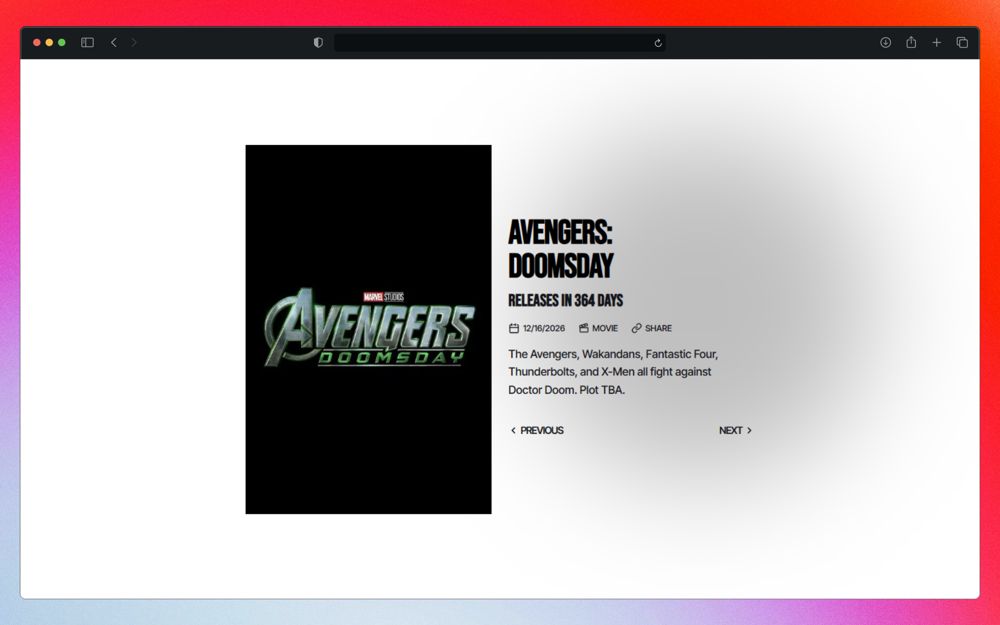

<h3 align="center"><b>NEXT MCU</b></h3>

<a href="https://mcu.esflowers.icu/"><code>mcu.esflowers.icu</code></a>

### Stack

- **[PHP](https://www.php.net/ "php.net")** / General-purpose scripting language.
- **[MCU-Countdown](https://github.com/DiljotSG/MCU-Countdown)** / API for answering the question *When is the next MCU film?*
- **[Iconoir](https://iconoir.com/ "iconoir.com")** / High-quality selection of free icons.
- **[Lucide](https://lucide.dev/ "lucide.dev")** / Beautiful & consistent icons.

### Fonts

- **[Bebas Neue](https://bebasneue.com/ "bebasneue.com")** / Display typeface crafted for impactful headlines, captions, and title use. *Designed by Dharma Type’s Ryoichi Tsunekawa*.
- **[Inter Tight](https://github.com/rsms/inter-gf-tight)** / Specialized version of *Inter* with tighter spacing, for display usage. *Designed by Rasmus Andersson*.

### Colors

/ **[Preview](https://coolors.co/ffffff-ee171f-040309-141319 'coolors.co')**.

- White / `#ffffff`.
- Brand / `#ee171f`.
- Primary / `#040309`.
- Secondary / `#141319`.
